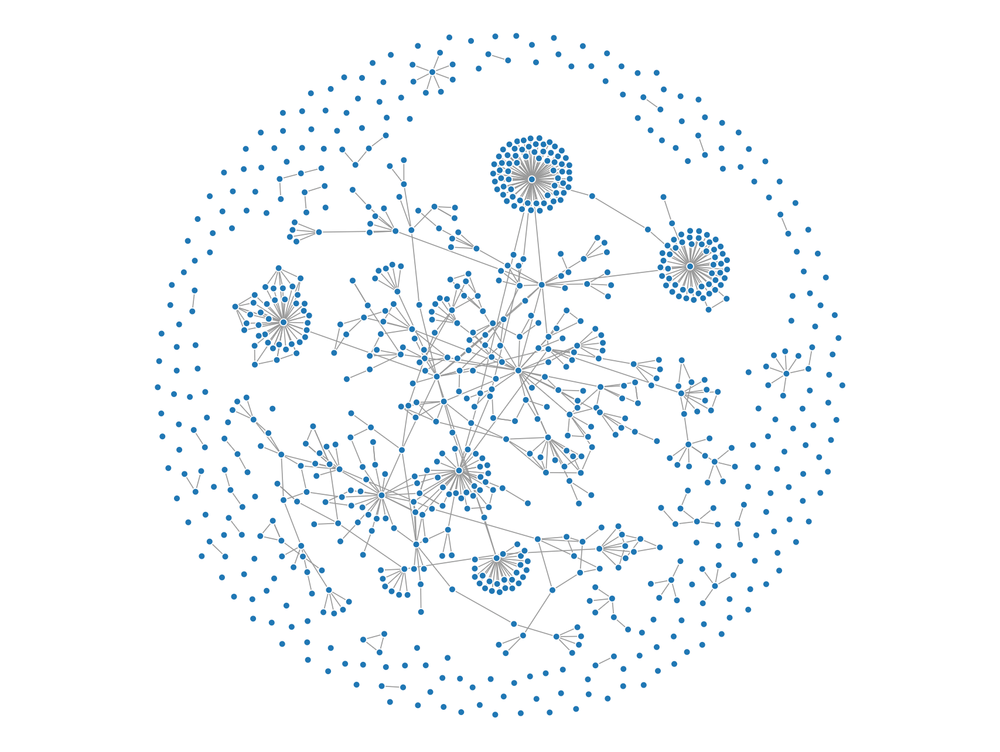
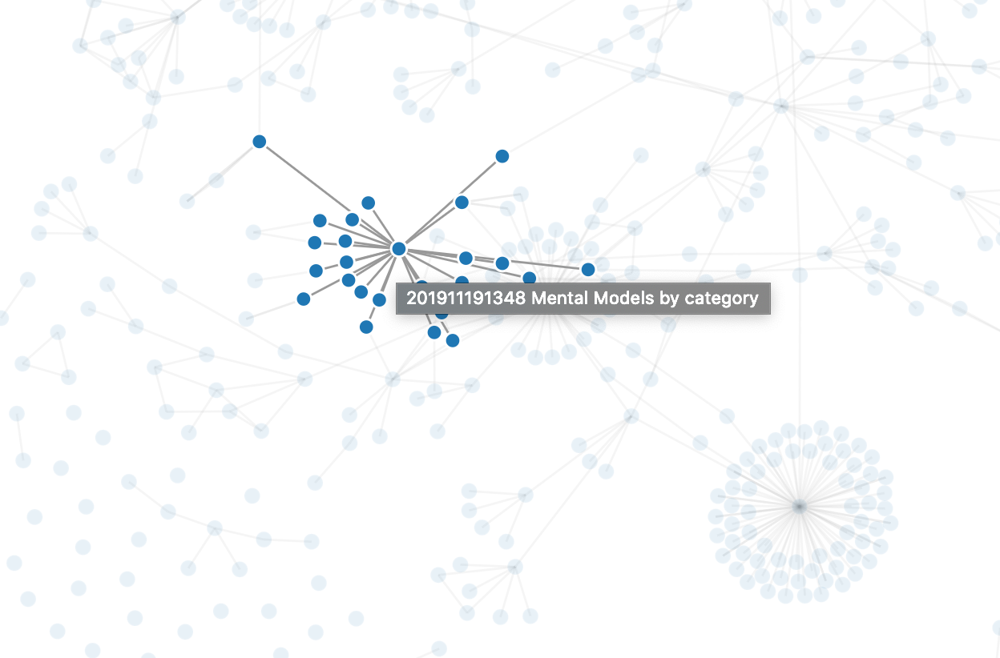

# ZettelTools

Collections of tools for Zettelkasten note-taking system.
This code is intended for personal use. It follows my own note-taking convention, from file name to individual note structure.
I mainly use it to visualize the connections between my notes.

## Usage

```shell script
$ python zettviss.py <slip_box_directory>
```

This will show the following visualization:



You can mouseover the note to read the note's title and its direct children.

